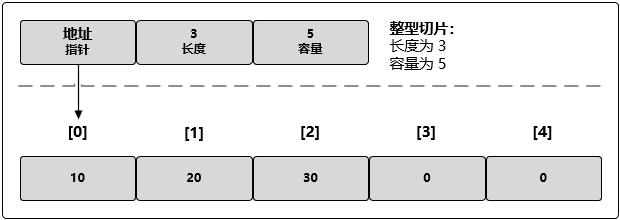

# Golang slice

## python切片与golang切片的不同

* python的切片返回的新数据是原数据的一个副本，对新数据对象的成员的操作不影响原数据对象；go的切片产生的是旧对象一部分的引用，对其成员的操作会影响旧对象。当go切片数据容量超过原数据后，切片底层会重新生成一个长度为原来2倍的数组，并把原有的老数据都拷贝到新的数组里面，接下来的所有修改都是对这个新的数组进行修改。

* go的切片起止下标不能为负数，python的可以为负数。

## 切片与数组的区别

数组定长；切片不定长。

## 切片的内部结构

slice可以按需自动增长和缩小。切片的动态增长是通过内置函数 append() 来实现的，这个函数可以快速且高效地增长切片，也可以通过对切片再次切割，缩小一个切片的大小。

切片是一个很小的对象，它对底层的数组(内部是通过数组保存数据的)进行了抽象，并提供相关的操作方法。切片是一个有三个字段的数据结构，这些数据结构包含 Golang 需要操作底层数组的元数据：

* 指向底层数组的指针
* 切片的长度
* 切片允许增长到的元素个数(容量)

## 切片的创建和初始化

### make()

    slice1 := make([]int, 5) //长度5，容量5
    slice2 := make([]string, 3, 5) //长度3， 容量5

### 直接创建

    myS := []string{"ID", "Name", "Tname", "Gname", "Date"} //长度和容量都是5

> 直接创建时，区别数组和切片，[]中无值的是切片，有值的是数组

### 切片切割的子切片

    myS := myArray[:]

**共享底层数据切片**：一个切片的一个元素修改，另一个切片的对应位置的元素值也变化。

### 切片的追加，头插，指定位置插入，删头节点，删尾节点，删指定节点

头插：

    // 在mySlice的前面插入666，777，888三个元素的切片（可插入单个元素，也可插入切片），并且定义赋初值给mySlice2
    mySlice2 := append([]int{666, 777, 888}, mySlice...)
    // 将666，777，888，赋给mySlice2头部，后面跟mySlice的下标2以及之后的数据（mySlice[0]和mySlice[1]删去了）
    mySlice2 = append([]int{666, 777, 888}, mySlice[2:]...)

追加：

    // 在mySlice2后面追加999，1000
    mySlice2 = append(mySlice2, 999, 1000)

指定位置插入：

    // mySlice2的下标为3的位置插入新数据333，（可插入单个元素，也可插入切片）
    mySlice2 = append(mySlice2[:3], append([]int{333}, mySlice2[3:]...)...)

删除指定位置元素：

    // 删去了index为3和4的元素
    mySlice2 = append(mySlice2[:3], mySlice2[5:]...)

    // 删去末尾元素
    mySlice2 = append(mySlice2[:len(mySlice2)-1])

    // 删去头元素
    mySlice2 = append(mySlice2[1:])

