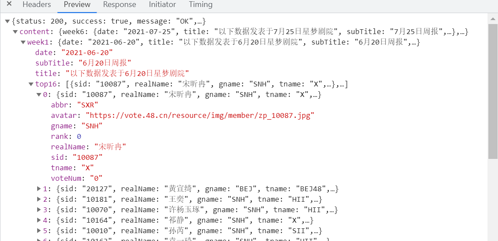

# encoding/json

标准库encoding/json解析JSON有两种方式：

* 根据JSON内容格式定义对应的结构体（struct）
* 使用map[string]interface{}加载JSON数据。

实际工作中，不建议采用根据JSON内容格式定义对应的结构体（struct），当JSON内容格式过于复杂的时候，对应的结构体（struct）会随之增加，这样会增加大量的代码。建议采用使用map[string]interface{}加载JSON数据

代码示例中json数据结构如下：

实现代码如下:

    package main

    import (
        "encoding/json"
        "fmt"
        "io/ioutil"
        "net/http"
    )

    func main() {

        //通过url获取数据
        resp, err := http.Get("https://vote.48.cn/resource/json/reprotinfo.json")
        if err != nil {
            panic(err)
        }
        defer resp.Body.Close()

        //解析url获取的response的body部分
        if resp.StatusCode != http.StatusOK {
            fmt.Println("Error: status code", resp.StatusCode)
        }
        all, err := ioutil.ReadAll(resp.Body)
        if err != nil {
            panic(err)
        }

        //创建map[string]interface{}存放json数据
        r := make(map[string]interface{})
        json.Unmarshal([]byte(all), &r)

        //读取指定json字段
        fmt.Println(r["content"].(map[string]interface{})["week1"].(map[string]interface{})["top16"].([]interface{})[0])
        fmt.Println(r["content"].(map[string]interface{})["week1"].(map[string]interface{})["top16"].([]interface{})[0].(map[string]interface{})["abbr"])
    }

打印结果

    map[abbr:SXR avatar:https://vote.48.cn/resource/img/member/zp_10087.jpg gname:SNH rank:0 realName:宋昕冉 sid:10087 tname:X voteNum:0]
    SXR
