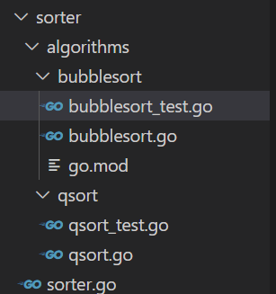

# testing

testing 中提供了 T 类型⽤于单元测试，B 类型⽤于性能测试。测试代码被放在 *_test.go ⽂件中，golang推荐测试文件和源文件放在同一目录下，以便访问私有成员。

运行`go test`，该包下所有的测试用例都会被执行。

运行`go test -v`，`-v` 参数会显示每个用例的测试结果，另外 `-cover` 参数可以查看覆盖率。

示例：

源代码文件：

    // bubblesort.go
    package bubblesort

    func BubbleSort(values []int) {
        flag := true

        for i := 0; i < len(values)-1; i++ {
            flag = true
            for j := 0; j < len(values)-i-1; j++ {
                if values[j] > values[j+1] {
                    values[j], values[j+1] = values[j+1], values[j]
                    flag = false
                }
            }
            if flag {
                break
            }
        }
    }

测试文件：

    //bubblesort_test.go
    package bubblesort

    import "testing"

    func TestBubbleSort1(t *testing.T) {
        values := []int{5, 4, 3, 2, 1}
        BubbleSort(values)
        if values[0] != 1 || values[1] != 2 || values[2] != 3 || values[3] != 4 || values[4] != 5 {
            t.Error("BubbleSort() failed. Got", values, "Expected 1 2 3 4 5")
        }
    }

代码目录：

执行命令：

1. go mod init sorter
2. go test -v

测试结果：

    === RUN   TestBubbleSort1
    PASS
    ok      sorter  0.516s